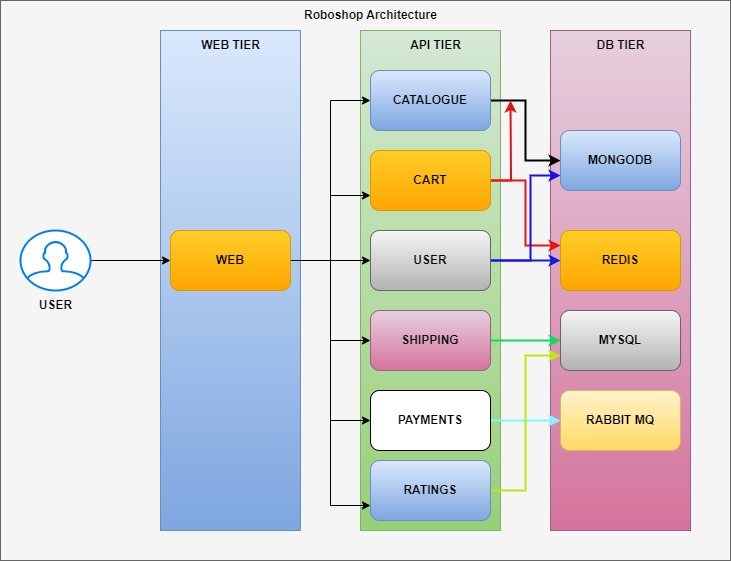

# roboshop-documentation

Below is the communication between components and dependency. This dependency comes from **Development team**. Architects decide that, DevOps has no scope in this.

### WEB TIER:
* Usually web tier is the one which has frontend technologies like HTML, CSS, Java Script (React/Angular/Node).
* We use web server to deploy these kind of applications.
* Earlier Apache Server was popular, Now Nginx is the most popular web server.

### APP TIER:
* APP/API Tier is the one which has backend technologies like Java, .NET, Python, Go, Php, etc.
* Earlier Backend technologies had servers like tomcat, Jboss, IIS, etc.
* Now all backend technologies are coming up with in built servers.
* Usually API tier should not opened through internet, it should be only accessible through web tier.

### DB TIER:
* Storage of the applications will be here like user data, products, orders data, etc.
* We can use RDBMS like MySQL, MSSQL, Postgress, etc for row and column based data.
* We can use NoSQL databases like MongoDB for storing the product information.
* We can use Cache servers like Redis to access the data with lightening speed.
* We can use MQ Servers like RabbitMQ, ActiveMQ, Kafka, etc for asynchronous communication.

--------------

## Services & Ports

| Service | Port | Technology |
|---------|------|------------|
| Frontend | 80 | Nginx |
| Catalogue | 8080 | NodeJS |
| User | 8080 | NodeJS |
| Cart | 8080 | NodeJS |
| Shipping | 8080 | Java/Maven |
| Payment | 8080 | Python |
| Dispatch | - | GoLang (consumer only) |
| MongoDB | 27017 | NoSQL Database |
| Redis | 6379 | In-memory Cache |
| MySQL | 3306 | SQL Database |
| RabbitMQ | 5672 | Message Queue |

## Security Groups

> **Legend:**
> 🟡 SSH &nbsp;&nbsp; 🔴 Public Internet &nbsp;&nbsp; 🔵 Internal (Security Group)

---

### roboshop-frontend

| # | Port | Protocol | Source | Description |
|---|------|----------|--------|-------------|
| 🟡 | 22 | TCP | MY-IP/32 | SSH access |
| 🔴 | 80 | TCP | 0.0.0.0/0 | HTTP from internet |

---

### roboshop-catalogue

| # | Port | Protocol | Source | Description |
|---|------|----------|--------|-------------|
| 🟡 | 22 | TCP | MY-IP/32 | SSH access |
| 🔵 | 8080 | TCP | roboshop-frontend | Frontend reverse proxy |
| 🔵 | 8080 | TCP | roboshop-cart | Cart service lookup |

---

### roboshop-user

| # | Port | Protocol | Source | Description |
|---|------|----------|--------|-------------|
| 🟡 | 22 | TCP | MY-IP/32 | SSH access |
| 🔵 | 8080 | TCP | roboshop-frontend | Frontend reverse proxy |
| 🔵 | 8080 | TCP | roboshop-payment | Payment user verification |

---

### roboshop-cart

| # | Port | Protocol | Source | Description |
|---|------|----------|--------|-------------|
| 🟡 | 22 | TCP | MY-IP/32 | SSH access |
| 🔵 | 8080 | TCP | roboshop-frontend | Frontend reverse proxy |
| 🔵 | 8080 | TCP | roboshop-shipping | Shipping cart lookup |
| 🔵 | 8080 | TCP | roboshop-payment | Payment cart lookup |

---

### roboshop-shipping

| # | Port | Protocol | Source | Description |
|---|------|----------|--------|-------------|
| 🟡 | 22 | TCP | MY-IP/32 | SSH access |
| 🔵 | 8080 | TCP | roboshop-frontend | Frontend reverse proxy |

---

### roboshop-payment

| # | Port | Protocol | Source | Description |
|---|------|----------|--------|-------------|
| 🟡 | 22 | TCP | MY-IP/32 | SSH access |
| 🔵 | 8080 | TCP | roboshop-frontend | Frontend reverse proxy |

---

### roboshop-dispatch

| # | Port | Protocol | Source | Description |
|---|------|----------|--------|-------------|
| 🟡 | 22 | TCP | MY-IP/32 | SSH access |

> Dispatch is a RabbitMQ consumer — it makes outbound connections only, no inbound ports required.

---

### roboshop-mongodb

| # | Port | Protocol | Source | Description |
|---|------|----------|--------|-------------|
| 🟡 | 22 | TCP | MY-IP/32 | SSH access |
| 🔵 | 27017 | TCP | roboshop-catalogue | Catalogue reads product data |
| 🔵 | 27017 | TCP | roboshop-user | User reads/writes user accounts |

---

### roboshop-redis

| # | Port | Protocol | Source | Description |
|---|------|----------|--------|-------------|
| 🟡 | 22 | TCP | MY-IP/32 | SSH access |
| 🔵 | 6379 | TCP | roboshop-user | User session caching |
| 🔵 | 6379 | TCP | roboshop-cart | Cart data caching |

---

### roboshop-mysql

| # | Port | Protocol | Source | Description |
|---|------|----------|--------|-------------|
| 🟡 | 22 | TCP | MY-IP/32 | SSH access |
| 🔵 | 3306 | TCP | roboshop-shipping | Shipping reads city/distance data |

---

### roboshop-rabbitmq

| # | Port | Protocol | Source | Description |
|---|------|----------|--------|-------------|
| 🟡 | 22 | TCP | MY-IP/32 | SSH access |
| 🔵 | 5672 | TCP | roboshop-payment | Payment publishes order messages |
| 🔵 | 5672 | TCP | roboshop-dispatch | Dispatch consumes order messages |

---
